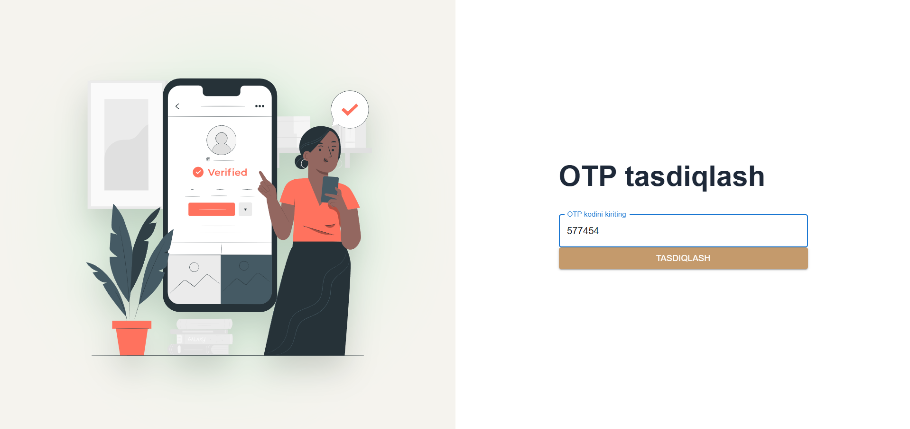
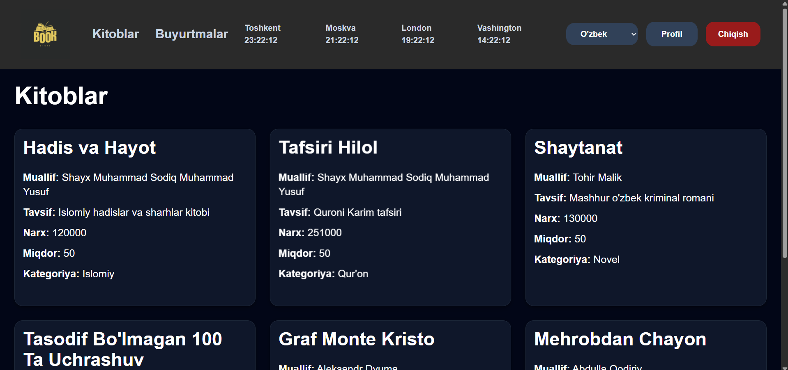
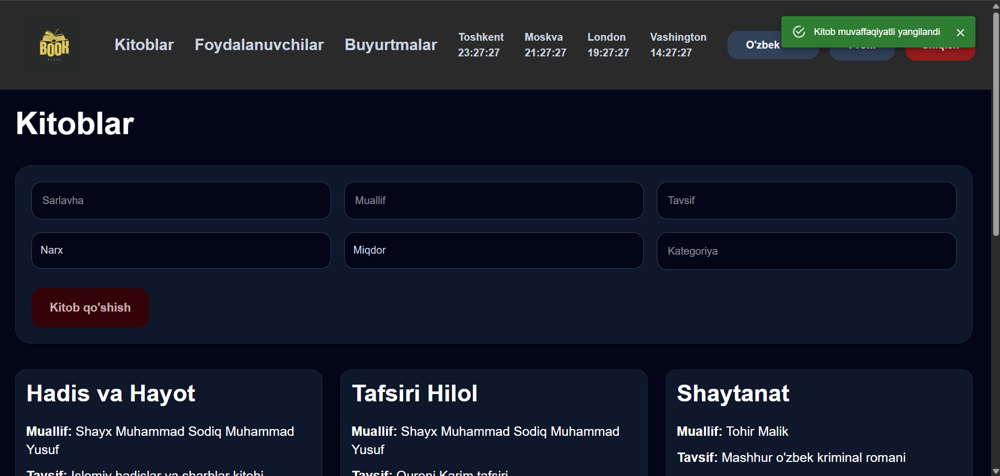
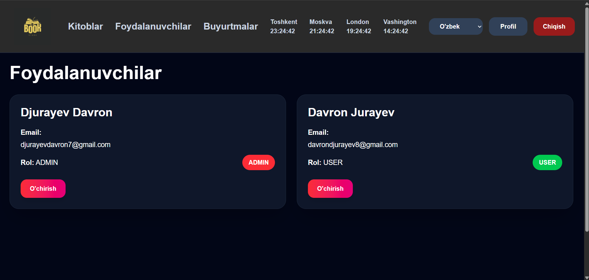
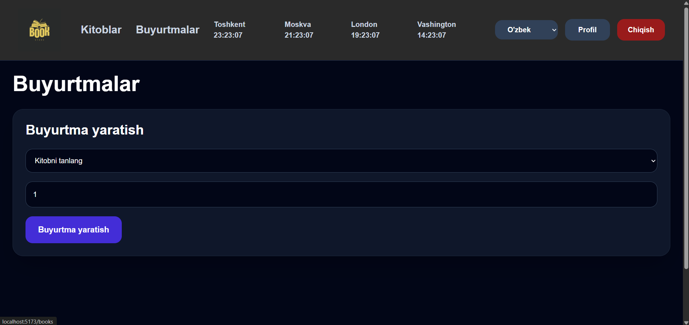
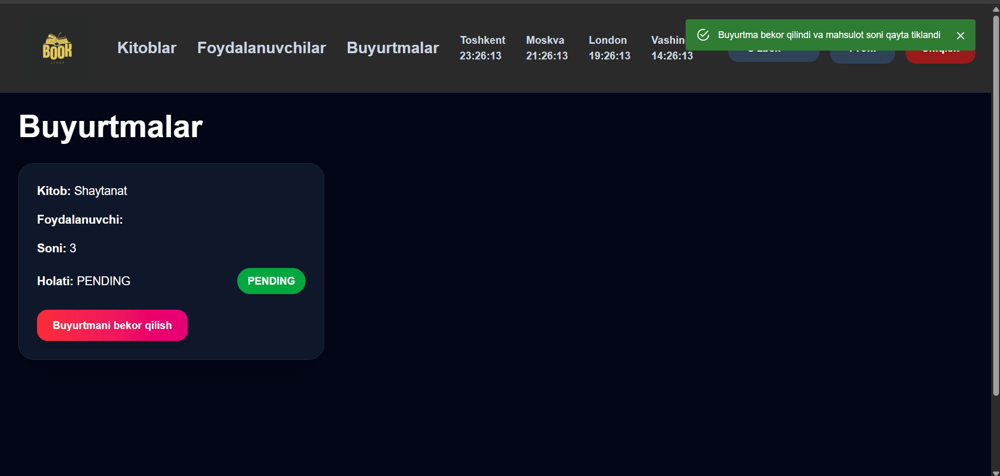
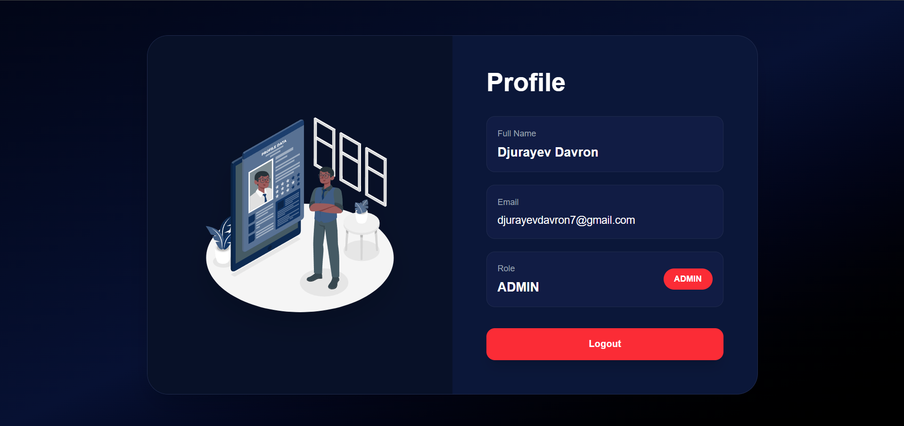
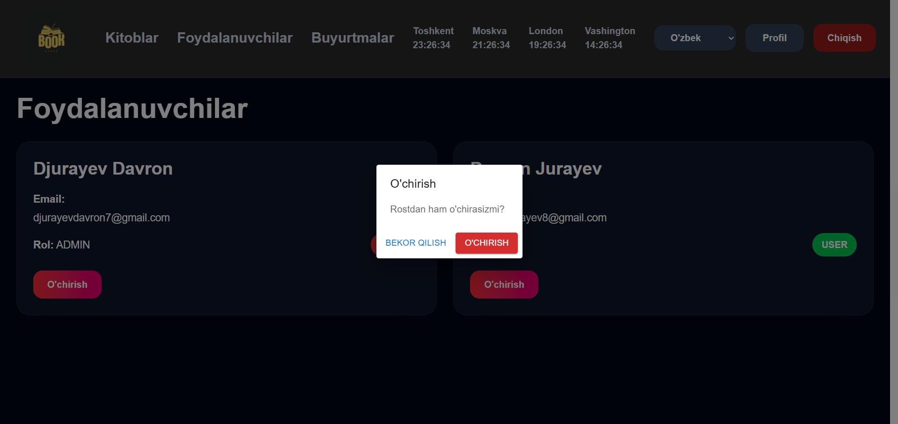

# BookStore Admin

A modern full-stack Book Store Admin Dashboard built with React, TypeScript, Tailwind CSS, Node.js, Express, MongoDB, JWT Authentication, OTP Verification, and Multi Language Support.

This project provides authentication, role-based access control, book management, user management, order management, and multilingual support with a modern responsive UI.

Zamonaviy full-stack Book Store Admin Dashboard bo'lib, React, TypeScript, Tailwind CSS, Node.js, Express, MongoDB, JWT Authentication, OTP Verification va Multi Language Support yordamida yaratilgan.

Loyiha autentifikatsiya, role asosidagi ruxsatlar, kitoblar boshqaruvi, foydalanuvchilar boshqaruvi, buyurtmalar boshqaruvi hamda ko'p tillilik imkoniyatlarini zamonaviy responsive interfeys bilan taqdim etadi.

---

# Screenshots | Suratlar

## Authentication | Autentifikatsiya

### Login


### Register | Ro'yxatdan o'tish


### OTP Verification | OTP Tasdiqlash



---

## Dashboard

### Books Page | Kitoblar Sahifasi



### Books Management | Kitoblarni Boshqarish



### Users Management | Foydalanuvchilarni Boshqarish



### Create Order | Buyurtma Yaratish



### Orders Management | Buyurtmalarni Boshqarish



### Profile Page | Profil Sahifasi



### Delete Confirmation Dialog | O'chirishni Tasdiqlash Oynasi



---

# Features | Xususiyatlar

* JWT Authentication — JWT autentifikatsiya
* OTP Email Verification — OTP email tasdiqlash
* Protected Routes — Himoyalangan route lar
* Role Based Access (ADMIN / USER) — Role asosidagi access (ADMIN / USER)
* Responsive Design — Responsive dizayn
* Mobile Hamburger Menu — Mobile hamburger menu
* Modern Premium UI — Zamonaviy premium UI
* Book Management (CRUD) — Kitoblarni boshqarish (CRUD)
* User Management — Foydalanuvchilarni boshqarish
* Order Management — Buyurtmalarni boshqarish
* Skeleton Loading States — Skeleton loading holatlari
* Toast Notifications — Bildirishnomalar
* Confirmation Dialogs — Tasdiqlash oynalari
* Custom Favicon — Custom favicon
* Responsive Navbar — Responsive navbar
* Dark Dashboard Theme — Qorong'i dashboard mavzusi
* Multi Language Support (UZ / RU / EN) — Ko'p tilli qo'llab-quvvatlash
* Language Persistence with LocalStorage — Tilni LocalStorage orqali saqlash
* Dynamic Translation with i18next — i18next orqali dinamik tarjima
* World Clock Support — Dunyo soatlari ko'rsatilishi

---

# Technologies | Texnologiyalar

## Frontend

* React.js
* TypeScript
* Tailwind CSS
* React Router DOM
* Axios
* i18next
* react-i18next
* React Hot Toast
* Material UI

## Backend

* Node.js
* Express.js
* MongoDB
* Mongoose
* JWT
* Bcrypt
* Brevo Email Service

---

# TypeScript Migration | TypeScript Migratsiyasi

The project has been fully migrated from JavaScript to TypeScript.

Migrated files:

* Books.jsx - Books.tsx
* Users.jsx - Users.tsx
* Login.jsx - Login.tsx
* Register.jsx - Register.tsx
* VerifyOtp.jsx - VerifyOtp.tsx
* Profile.jsx - Profile.tsx
* Orders.jsx - Orders.tsx
* ProtectedRoute.jsx - ProtectedRoute.tsx
* App.jsx - App.tsx
* main.jsx - main.tsx
* Navbar.jsx - Navbar.tsx
* LanguageSwitcher.jsx - LanguageSwitcher.tsx
* api.js - api.ts

Implemented TypeScript features:

* Interfaces for data models
* Typed useState hooks
* Promise return types
* ReactNode typed props
* Type-safe LocalStorage usage
* Strict TypeScript mode

---

Loyiha JavaScript dan TypeScript ga to'liq o'tkazilgan.

O'tkazilgan fayllar:

* Books.jsx → Books.tsx
* Users.jsx → Users.tsx
* Login.jsx → Login.tsx
* Register.jsx → Register.tsx
* VerifyOtp.jsx → VerifyOtp.tsx
* Profile.jsx → Profile.tsx
* Orders.jsx → Orders.tsx
* ProtectedRoute.jsx → ProtectedRoute.tsx
* App.jsx → App.tsx
* main.jsx → main.tsx
* Navbar.jsx → Navbar.tsx
* LanguageSwitcher.jsx → LanguageSwitcher.tsx
* api.js → api.ts

Qo'shilgan TypeScript imkoniyatlari:

* Interface lar yordamida ma'lumotlarni tiplashtirish
* Typed useState hook lar
* Promise return type lar
* ReactNode typed props
* Type-safe LocalStorage ishlatish
* Strict TypeScript mode
---

# Responsive Design | Responsive Dizayn

The application is fully responsive for Mobile, Tablet, Laptop, and Desktop devices.

Ilova Mobile, Tablet, Laptop va Desktop qurilmalar uchun to'liq moslashtirilgan.

---

# Internationalization (i18n) | Ko'p Tillilik

The application supports three languages:

* English
* Russian
* Uzbek

Users can switch language dynamically from the navbar. The selected language is stored in LocalStorage and remains active even after logout or page refresh.

Ilova uchta tilni qo'llab-quvvatlaydi:

* Ingliz tili
* Rus tili
* O'zbek tili

Foydalanuvchi navbar orqali tilni almashtirishi mumkin. Tanlangan til LocalStorage da saqlanadi va sahifa yangilanganda yoki tizimdan chiqilganda ham saqlanib qoladi.

---

# Authentication | Autentifikatsiya

* Register — Ro'yxatdan o'tish
* Login — Tizimga kirish
* OTP Verification — OTP tasdiqlash
* JWT Token Authentication — JWT token autentifikatsiyasi
* Protected Profile Page — Himoyalangan profil sahifasi

---

# Installation | O'rnatish

## Frontend

```bash
npm install
npm run dev
```

## Backend

```bash
npm install
npm run dev
```

---

# Pages | Sahifalar

* Login
* Register
* Verify OTP
* Books
* Users
* Orders
* Profile

---

# Author | Muallif

Davron Jurayev
