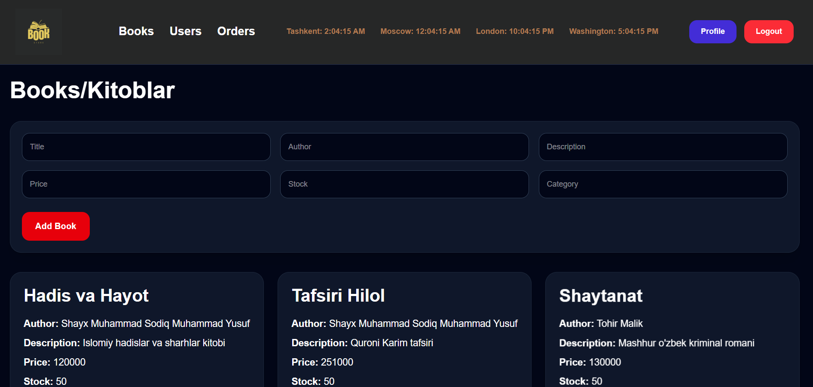
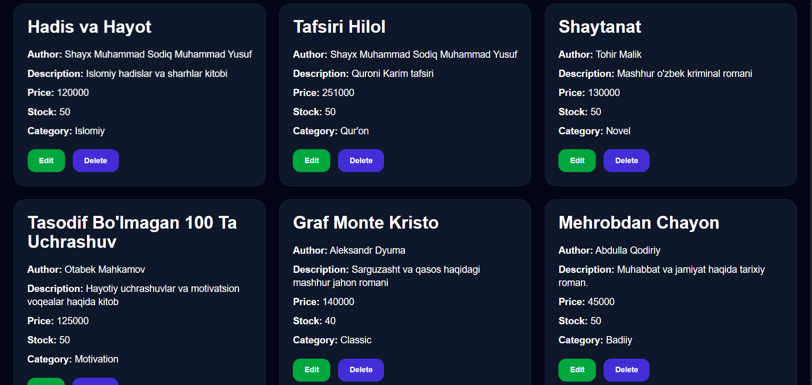
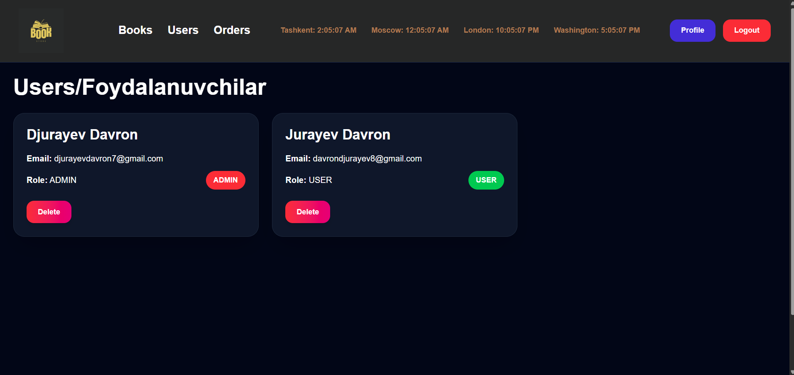

# BookStore Admin

A modern Book Store Admin Dashboard built with React, Tailwind CSS, Node.js, Express, MongoDB, JWT Authentication, and OTP Verification.

Zamonaviy Book Store Admin Dashboard bo'lib, React, Tailwind CSS, Node.js, Express, MongoDB, JWT Authentication va OTP Verification yordamida yaratilgan.

---

# Features | Xususiyatlar

- JWT Authentication — JWT autentifikatsiya
- OTP Email Verification — OTP email tasdiqlash
- Protected Routes — Himoyalangan route lar
- Role Based Access (ADMIN / USER) — Role asosidagi access (ADMIN / USER)
- Responsive Design — Responsive dizayn
- Mobile Hamburger Menu — Mobile hamburger menu
- Modern Premium UI — Zamonaviy premium UI
- Book Management — Kitoblarni boshqarish
- User Management — Userlarni boshqarish
- Order Management — Orderlarni boshqarish
- Custom Favicon — Custom favicon
- Responsive Navbar — Responsive navbar
- Dark Dashboard Theme — Dark dashboard theme

---

# Screenshots

## Login Page


---

## Books Page



---

## Add Book Page



---

## Users Page



---

## Profile Page


---

# Technologies | Texnologiyalar
## Frontend

- React.js
- Tailwind CSS
- React Router DOM
- Axios

## Backend

- Node.js
- Express.js
- MongoDB
- Mongoose
- JWT
- Bcrypt
- Brevo Email Service

---

# Responsive Design | Responsive Dizayn

The application is fully responsive for Mobile, Tablet, Laptop, and Desktop devices.

Ilova Mobile, Tablet, Laptop va Desktop qurilmalar uchun to'liq moslashtirilgan.

---

# Authentication | Autentifikatsiya

- Register — Ro'yxatdan o'tish
- Login — Tizimga kirish
- OTP Verification — OTP tasdiqlash
- JWT Token Authentication — JWT token autentifikatsiyasi
- Protected Profile Page — Himoyalangan profile sahifasi

---

# Installation | O'rnatish

## Frontend

```bash id="s9l6qv"
npm install
npm run dev
```

## Backend

```bash id="l17qfg"
npm install
npm run dev
```

---

# Pages | Sahifalar

- Login
- Register
- Verify OTP
- Books
- Users
- Orders
- Profile

---

# Author | Muallif

Davron Jurayev
